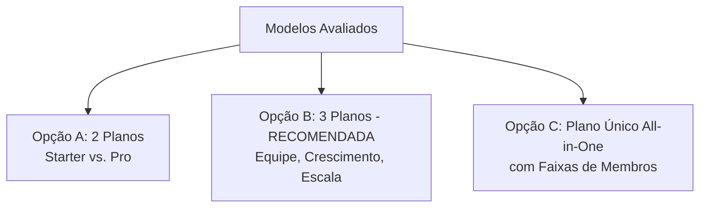
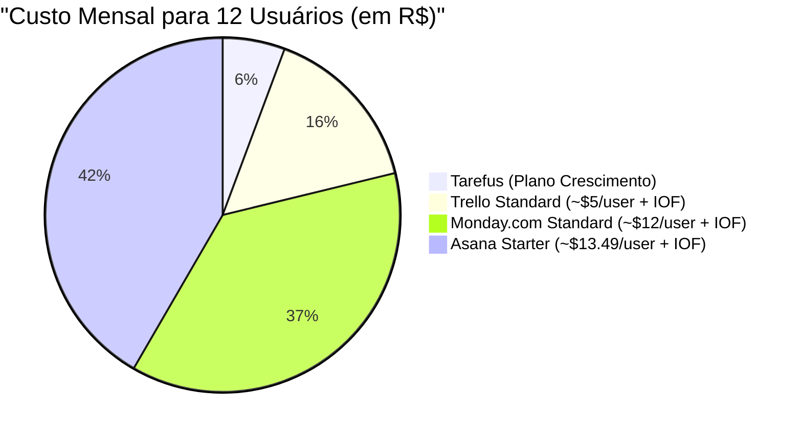
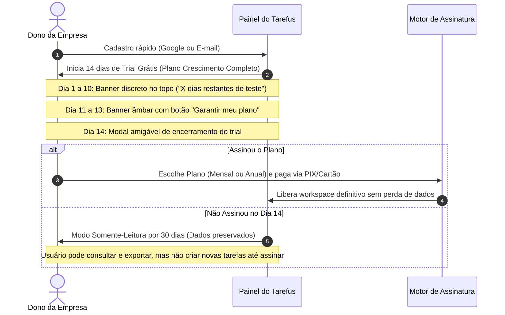
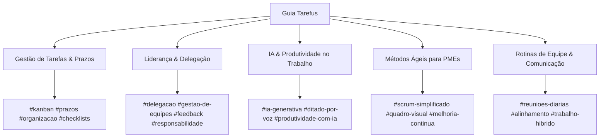
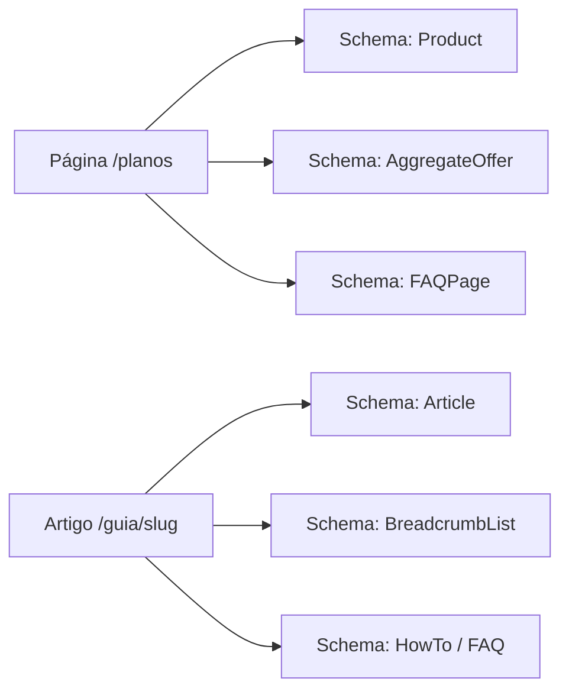

# Planejamento Comercial: Estratégia de Pricing e Arquitetura do Guia

**Produto:** Tarefus — Gestão Inteligente de Tarefas para Pequenas Empresas Brasileiras  
**Documento:** `02-pricing-and-guide-plan.md`  
**Autor:** Agente 2 — Planejamento Comercial (Pricing, Conversão e Guia Editorial)  
**Status:** Proposta Estratégica Completa & Hipóteses de Validação  
**Data:** Setembro de 2026  
**Público-Alvo:** Gestores, donos de pequenas empresas, equipes operacionais e lideranças no Brasil.

---

## Sumário Executivo

O **Tarefus** foi concebido para resolver o maior gargalo de produtividade das pequenas empresas brasileiras: a falta de clareza sobre responsáveis, prazos e prioridades, sem a complexidade e os custos proibitivos dos softwares corporativos internacionais.

Enquanto ferramentas concorrentes (Trello, Asana, Monday, ClickUp) cobram em **dólares por usuário individual** — gerando faturas imprevisíveis com IOF e desincentivando a inclusão de toda a equipe —, o Tarefus adota um posicionamento disruptivo para o mercado nacional:
1. **Cobrança por empresa com pacote de membros inclusos** (sem punição financeira por adicionar funcionários ou colaboradores).
2. **Preço fixo em Reais (R$)**, transparente, sem surpresas cambiais.
3. **Período de teste grátis de 14 dias sem exigência de cartão de crédito** no cadastro, sem plano gratuito permanente (focado em empresas qualificadas).
4. **Área pública de Guia de Boas Práticas**, atuando como hub educacional e motor de aquisição orgânica (Inbound/SEO) de alto valor agregado.

Este documento detalha os princípios de precificação, matrizes de planos, arquitetura de UX da página de Pricing, regras de copy ético, taxonomia do Guia, pauta editorial de 12 artigos e métricas de acompanhamento.

---

## 1. Princípios de Precificação do Tarefus

### 1.1. Modelo por Empresa vs. Modelo por Usuário Individual (Seat-Based)
A maioria dos SaaS internacionais adota a cobrança *per seat* (por usuário/mês). No contexto das micro e pequenas empresas brasileiras (1 a 50 funcionários), esse modelo gera comportamentos prejudiciais:
- **Compartilhamento de senhas:** Empresas compram 2 licenças e compartilham logins de administradores com 8 pessoas para economizar, destruindo a rastreabilidade e a segurança.
- **Exclusão de membros da operação:** Estagiários, terceirizados e auxiliares ficam fora do sistema, recorrendo ao WhatsApp e planilhas paralelas.
- **Aversão à expansão:** Cada nova contratação é vista como um novo custo de software.

**Princípio Fundamental do Tarefus:** A cobrança é **sempre por empresa/organização**, com faixas generosas de membros incluídos. A empresa paga um valor único previsível e coloca toda a sua equipe para colaborar sem receio de faturas variáveis no fim do mês.

### 1.2. Moeda, Tributação e Previsibilidade Financeira
- **Cobrança 100% em Reais (R$):** Fatura emitida no Brasil, sem incidência de IOF (Imposto sobre Operações Financeiras) de 4,38% a 5,38% sobre cartões internacionais.
- **Emissão automática de Nota Fiscal de Serviço eletrônica (NFS-e):** Conformidade fiscal simplificada para o financeiro da PME.
- **Preço transparente:** Sem taxas ocultas de setup, ativação ou custos por projeto criado.

### 1.3. Período de Teste Grátis (14 Dias) & Rejeição do Plano Free Permanente
- **14 Dias de Teste Grátis Completo:** Acesso irrestrito a todos os recursos do plano escolhido durante o período de avaliação.
- **Sem Cartão de Crédito no Cadastro:** Reduz o atrito inicial a quase zero. O usuário experimenta valor real no primeiro dia criando quadros e tarefas com IA.
- **Por que NÃO haverá plano gratuito permanente (Free Tier)?**
  - *Sustentabilidade de Custos:* Tarefus utiliza modelos de IA generativa (Gemini) e persistência em tempo real, que geram custos computacionais por chamada. Um plano gratuito permanente atrai usuários individuais casuais (B2C) com alto custo de suporte e baixa propensão a pagar.
  - *Qualificação do Lead:* Foca a base em pequenas empresas que valorizam organização profissional e têm capacidade de investimento.
  - *Preservação de Dados pós-Trial:* Se a empresa não assinar ao fim dos 14 dias, o workspace entra em modo leitura por 30 dias antes do congelamento, garantindo que os dados não sejam perdidos abruptamente.

### 1.4. Modelo de Upgrade, Downgrade e Cancelamento
- **Upgrade Instantâneo:** Ao atingir o limite de membros ou quadros de uma faixa, o administrador pode migrar de plano com cálculo pro-rata automático.
- **Downgrade Transparente:** Permitido no fechamento do ciclo, alertando sobre eventuais ajustes necessários caso a equipe atual exceda o limite do plano menor.
- **Cancelamento em 1 Clique:** Sem burocracia, sem ligações de retenção forçada. Os dados podem ser exportados em JSON/CSV a qualquer momento.

---

## 2. Análise Comparativa de Arquiteturas de Planos

Apresentamos três estruturas de empacotamento avaliadas para o Tarefus, com a recomendação justificada para o mercado brasileiro.



### Opção A: 2 Planos ("Starter" e "Pro")
- **Conceito:** Um plano de entrada (até 8 membros) e um plano avançado (até 25 membros).
- **Prós:** Extrema simplicidade cognitiva; página de preços limpa.
- **Contras:** Pouca flexibilidade para microempresas de 2 a 4 pessoas (que acham o plano de 8 pessoas caro) e empresas de 15 a 30 pessoas (que sentem um salto financeiro abrupto).
- **Veredito:** Descartada por limitar a monetização e o degrau natural de expansão.

### Opção B: 3 Planos ("Equipe", "Crescimento", "Escala") — [RECOMENDADA]
- **Conceito:** Três níveis estruturados por momento de maturidade da empresa:
  - **Plano 1: Equipe** (Até 5 membros) — Para microempresas e escritórios enxutos.
  - **Plano 2: Crescimento / Pro** (Até 15 membros) — **O plano âncora** ("Mais Escolhido"), atendendo ~70% do público-alvo.
  - **Plano 3: Escala / Empresa** (Até 35 membros) — Para operações consolidadas com múltiplos setores.
- **Prós:**
  - Aplica o consagrado efeito psicológico do plano intermediário (*Goldilocks Pricing*).
  - Alinha limites de membros e limites de IA ao tamanho real da operação.
  - Facilita a comunicação de valor e o upsell gradual.
- **Contras:** Exige uma tabela comparativa bem estruturada na página de preços.
- **Veredito:** **RECOMENDADA** pela melhor relação entre conversão inicial, ARPU (receita média por usuário) e retenção a longo prazo.

### Opção C: Plano Único "All-in-One" com Slider de Membros
- **Conceito:** O produto tem exatamente os mesmos recursos para todos, variando apenas uma régua deslizante de quantidade de membros (ex: até 5, até 10, até 20, até 40).
- **Prós:** Sensação de justiça matemática e simplicidade funcional.
- **Contras:** Menos apelo comercial; não permite ancorar recursos avançados (como limites maiores de IA, logs de auditoria longos e suporte prioritário); reduz a eficácia da ancoragem visual na landing page.
- **Veredito:** Descartada como formato primário, podendo inspirar apenas uma calculadora interativa complementar.

---

## 3. Faixas de Preço e Hipóteses Financeiras (Valores em R$)

> [!IMPORTANT]
> **Aviso de Hipóteses:** Os valores abaixo constituem faixas de referência e projeções financeiras para orientar o design e a estratégia de lançamento. Devem ser validados com clientes reais da fase beta antes do go-to-market definitivo.

### 3.1. Tabela Indicativa de Planos (Mensal vs. Anual)

| Plano | Membros Inclusos | Mensal (R$) | Anual Parcelado em 12x | Anual à Vista (PIX / 1x) | Economia no Anual |
|---|---|---|---|---|---|
| **Equipe** | Até 5 membros | **R\$ 69**/mês | **R\$ 55**/mês (12x de R\$ 55 = R\$ 660/ano) | **R\$ 590**/ano (~R\$ 49/mês) | ~20% (2 meses grátis) |
| **Crescimento** ⭐ *(Recomendado)* | Até 15 membros | **R\$ 139**/mês | **R\$ 109**/mês (12x de R\$ 109 = R\$ 1.308/ano) | **R\$ 1.180**/ano (~R\$ 98/mês) | ~21% (2,5 meses grátis) |
| **Escala** | Até 35 membros | **R\$ 269**/mês | **R\$ 215**/mês (12x de R\$ 215 = R\$ 2.580/ano) | **R\$ 2.290**/ano (~R\$ 190/mês) | ~22% (quase 3 meses grátis) |

*Empresas com mais de 35 membros:* Pacote adicional de `+10 membros por R$ 60/mês` ou atendimento corporativo consultivo.

### 3.2. Comparativo de Custo Real: Tarefus vs. Concorrentes no Brasil

Para uma pequena empresa brasileira com **12 colaboradores**:



- **No Asana Starter:** 12 usuários × US\$ 13,49 ≈ US\$ 161,88 ≈ **R\$ 970 a R\$ 1.050/mês** (+ IOF do cartão internacional).
- **No Monday Standard:** 12 usuários × US\$ 12,00 ≈ US\$ 144,00 ≈ **R\$ 860 a R\$ 930/mês** (+ IOF).
- **No Trello Standard:** 12 usuários × US\$ 5,00 ≈ US\$ 60,00 ≈ **R\$ 360 a R\$ 390/mês** (+ IOF).
- **No Tarefus (Plano Crescimento):** **R\$ 139/mês fixo** (ou R\$ 109/mês no anual).
- **Economia para a PME:** Redução de **60% a 85% no custo de software**, sem abrir mão de quadros visuais, prazos, perfis de membros e IA nativa em português.

### 3.3. Unit Economics & Pressupostos de Viabilidade
- **Custo de IA (Google Gemini 2.5/Flash):** Cerca de US\$ 0,0002 a US\$ 0,0005 por tarefa gerada. Um plano com 300 tarefas criadas por IA/mês consome menos de R\$ 0,80 em custos de API.
- **Custo de Infraestrutura (Firebase / Cloud Hosting):** Leituras, gravações e armazenamento de documentos JSON representam menos de R\$ 1,50 por workspace ativo/mês.
- **Margem Bruta Estimada:** Superior a **88%**, garantindo alta escalabilidade e sustentabilidade financeira.

---

## 4. Matriz Completa de Recursos por Plano

| Categoria / Recurso | Plano Equipe (R\$ 69/mês) | Plano Crescimento ⭐ (R\$ 139/mês) | Plano Escala (R\$ 269/mês) |
|---|---|---|---|
| **Usuários & Equipe** | | | |
| Membros incluídos | Até 5 membros | Até 15 membros | Até 35 membros |
| Papéis de acesso (Admin, Gestor, Membro) | ✅ Sim | ✅ Sim | ✅ Sim |
| Convite por e-mail com 1 clique | ✅ Sim | ✅ Sim | ✅ Sim |
| **Quadros & Tarefas** | | | |
| Tarefas e subtarefas (checklists) | **Ilimitadas** | **Ilimitadas** | **Ilimitadas** |
| Quadros / Áreas ativas | Até 5 quadros | Até 20 quadros | **Quadros Ilimitados** |
| Filtro "Minhas Tarefas" individual | ✅ Sim | ✅ Sim | ✅ Sim |
| Alertas visuais de prazos (Hoje / Atrasadas) | ✅ Sim | ✅ Sim | ✅ Sim |
| Tags e etiquetas coloridas | ✅ Sim | ✅ Sim | ✅ Sim |
| Anexos e descrições ricas | ✅ Sim | ✅ Sim | ✅ Sim |
| **Inteligência Artificial (Gemini)** | | | |
| Criação de tarefas por texto e voz | ✅ Sim | ✅ Sim | ✅ Sim |
| Cota mensal de geração de tarefas por IA | 100 criações / mês | 400 criações / mês | **1.200 criações / mês** |
| Geração automática de subtarefas/checklist | ✅ Sim | ✅ Sim | ✅ Sim |
| Identificação automática de responsáveis | ✅ Sim | ✅ Sim | ✅ Sim |
| **Segurança & Governança** | | | |
| Histórico de atividades e Logs de Auditoria | Últimos 30 dias | Últimos 180 dias | **Histórico Completo (Ilimitado)** |
| Exportação de dados (JSON/CSV) | ✅ Sim | ✅ Sim | ✅ Sim |
| Backup diário automático na nuvem | ✅ Sim | ✅ Sim | ✅ Sim |
| Conformidade com LGPD | ✅ Sim | ✅ Sim | ✅ Sim |
| **Suporte & Treinamento** | | | |
| Central de Ajuda & Guia de IA integrado | ✅ Sim | ✅ Sim | ✅ Sim |
| Tour Interativo onboarding | ✅ Sim | ✅ Sim | ✅ Sim |
| Canal de atendimento | E-mail (resposta em até 24h úteis) | E-mail prioritário & Chat (até 8h úteis) | **WhatsApp dedicado & Onboarding VIP** |

---

## 5. Estrutura Detalhada da Página de Pricing (`/planos`)

### 5.1. Wireframe e Sequência de Blocos de Conversão

```
┌────────────────────────────────────────────────────────────────────────┐
│ 1. HEADER & HERO DE PREÇOS                                             │
│   • Badge: "Sem Pegadinha de Preço por Usuário"                        │
│   • H1: "Planos simples e previsíveis para a sua empresa inteira."     │
│   • Sub: "Pague um valor fixo por mês em Reais. Sem surpresas."        │
│   • TOGGLE MENSAL / ANUAL [Economize até 22% + 2 meses grátis]         │
├────────────────────────────────────────────────────────────────────────┤
│ 2. GRID COM OS 3 CARDS DE PLANOS                                       │
│   ┌───────────────┐  ┌──────────────────────┐  ┌────────────────────┐  │
│   │    EQUIPE     │  │  CRESCIMENTO (Destaque) │  │       ESCALA       │  │
│   │   R$ 69/mês   │  │      R$ 139/mês      │  │     R$ 269/mês     │  │
│   │  Até 5 membros│  │    Até 15 membros    │  │   Até 35 membros   │  │
│   │ [Testar 14 d] │  │ [Testar 14 d Grátis] │  │ [Testar 14 d Grátis]│  │
│   └───────────────┘  └──────────────────────┘  └────────────────────┘  │
├────────────────────────────────────────────────────────────────────────┤
│ 3. CALCULADORA DE ECONOMIA vs. FERRAMENTAS EM DÓLAR                   │
│   • Slider: "Quantas pessoas trabalham com você?"                      │
│   • Comparativo em tempo real: Tarefus vs. Ferramentas Internacionais  │
├────────────────────────────────────────────────────────────────────────┤
│ 4. TABELA COMPARATIVA COMPLETA ("Ver todos os detalhes")               │
│   • Acordeão com recursos por categoria (Equipe, Quadros, IA, Suporte) │
├────────────────────────────────────────────────────────────────────────┤
│ 5. PROVA SOCIAL & DEPOIMENTOS DE PMEs BRASILEIRAS                     │
│   • "Conseguimos colocar a equipe comercial e operacional no mesmo app"│
├────────────────────────────────────────────────────────────────────────┤
│ 6. FAQ DE PREÇOS E CONTRATAÇÃO (Objeções respondidas)                  │
├────────────────────────────────────────────────────────────────────────┤
│ 7. CTA FINAL DE FECHAMENTO                                             │
│   • "Comece hoje seus 14 dias de teste grátis. Cancele quando quiser." │
└────────────────────────────────────────────────────────────────────────┘
```

### 5.2. Detalhamento de Seções, Copy e CTAs

#### Seção 1: Hero de Preços
- **Badge Superior:** `✨ PREÇO TRANSPARENTE EM REAIS`
- **Headline (H1):** *Chega de pagar em dólar por cada funcionário. Escolha o plano ideal para a sua empresa.*
- **Subtítulo:** *Inclua toda a sua equipe no Tarefus com um valor fixo mensal. Sem cobrança por usuário individual, sem IOF e com 14 dias de teste grátis sem precisar de cartão.*
- **Toggle de Ciclo de Faturamento:**
  - `[ Cobrança Mensal ]` vs. `[ Cobrança Anual (Economize até 22%) ]`
  - Micro-copy: *"Ganhe até 2 meses grátis no plano anual com parcelamento em até 12x no cartão ou desconto no PIX."*

#### Seção 2: Cards de Planos (Desktop & Mobile-First)
- **Card 1: Plano Equipe**
  - *Público:* Microempresas, consultorias e escritórios enxutos.
  - *Preço:* `R$ 69` / mês (ou `R$ 55`/mês no anual).
  - *Destaques:* Até 5 membros inclusos • Até 5 quadros • Tarefas ilimitadas • 100 criações com IA/mês • Suporte por e-mail.
  - *Botão CTA:* `Começar Teste de 14 Dias` (Estilo contorno neutro / secundário).
  
- **Card 2: Plano Crescimento ⭐ (Badge visual: "MAIS ESCOLHIDO PELAS PMEs")**
  - *Público:* Empresas em expansão que precisam conectar setores e projetos.
  - *Preço:* `R$ 139` / mês (ou `R$ 109`/mês no anual).
  - *Destaques:* **Até 15 membros inclusos** • **Até 20 quadros** • **400 criações com IA/mês** • **Logs de auditoria de 180 dias** • **Suporte prioritário**.
  - *Botão CTA:* `Experimentar Grátis por 14 Dias` (Estilo destaque: Indigo/Primário com sombra elevada).
  
- **Card 3: Plano Escala**
  - *Público:* Empresas estruturadas com múltiplas equipes e alta demanda operacional.
  - *Preço:* `R$ 269` / mês (ou `R$ 215`/mês no anual).
  - *Destaques:* Até 35 membros inclusos • **Quadros ilimitados** • **1.200 criações com IA/mês** • **Auditoria completa** • **Atendimento via WhatsApp**.
  - *Botão CTA:* `Começar Teste de 14 Dias` (Estilo contorno neutro / secundário).

#### Seção 3: Calculadora de Economia vs. Dólar
- Uma ferramenta interativa onde o visitante desliza o número de colaboradores (ex: de 3 a 35) e visualiza na hora:
  - *"Com 10 pessoas, você pagaria cerca de R$ 800/mês em softwares cotados em dólar."*
  - *"No Tarefus Plano Crescimento, você investe apenas **R$ 139/mês** (ou R$ 109 no anual)."*
  - **Sua economia estimada: R$ 7.900 por ano.**

#### Seção 4: FAQ Estruturado de Pricing (Quebra de Objeções)
1. **Preciso colocar meu cartão de crédito para fazer o teste grátis?**  
   *Não. O teste de 14 dias é totalmente livre. Você cria sua conta, convida sua equipe e começa a usar em menos de 2 minutos. Só pediremos os dados de pagamento se você decidir assinar ao final do período.*
2. **O que acontece se minha equipe passar do número de membros do plano?**  
   *Você receberá um aviso prévio no painel. É possível fazer o upgrade instantâneo para a faixa seguinte com recálculo proporcional do valor, sem qualquer interrupção nas suas tarefas.*
3. **A cobrança é realmente por empresa ou por pessoa?**  
   *Por empresa! Ao assinar um plano, você tem direito à quantidade de membros contratada sem pagar um centavo a mais por cada pessoa convidada.*
4. **Quais são as formas de pagamento aceitas?**  
   *Aceitamos Cartão de Crédito (mensal ou parcelado em até 12x no plano anual) e PIX à vista.*
5. **Posso cancelar a qualquer momento?**  
   *Sim. No plano mensal, você pode cancelar a renovação com 1 clique no painel a qualquer hora, sem multa ou fidelidade. Você continuará com acesso até o fim do período já pago.*
6. **Como funciona a criação de tarefas com Inteligência Artificial?**  
   *Você pode digitar ou ditar por voz comandos em português, e a IA do Tarefus estrutura automaticamente o título, descrição, quadro de destino, responsáveis, prazo e checklist de subtarefas. Cada plano conta com uma cota mensal generosa de gerações.*
7. **Vocês emitem Nota Fiscal?**  
   *Sim! Emitimos Nota Fiscal de Serviço (NFS-e) automaticamente para todas as assinaturas, vinculadas ao CNPJ ou CPF informado.*

### 5.3. Tratamento dos Estados de Teste e Pós-Teste (UX Flows)



---

## 6. Diretrizes de Comunicação Ética de Preço e Valor

Um dos maiores riscos no posicionamento de SaaS B2B é parecer um produto "barato", "limitado" ou "frágil" ao praticar preços muito mais acessíveis que os gigantes multinacionais. O Tarefus deve comunicar **eficiência, respeito ao cliente e adequação ao mercado brasileiro**, nunca "desconto desesperado".

### 6.1. Matriz de Linguagem: O que Falar vs. O que Evitar

| ❌ Evitar a todo custo | ✅ Usar com consistência | Por que essa escolha protege a marca? |
|---|---|---|
| *"O gerenciador mais baratinho do mercado"* | *"Preço justo, previsível e feito para a realidade brasileira"* | "Baratinho" soa amador; "Preço justo" soa profissional e ético. |
| *"Cópia do Trello em português"* | *"Uma experiência moderna, fluida e com IA nativa em português"* | Destaca inovação proprietária e relevância cultural em vez de cópia. |
| *"Não cobramos nada por usuário porque somos novos"* | *"Cobramos por empresa porque acreditamos que colaborar não deve custar mais caro"* | Transforma o modelo de precificação em um posicionamento de valor e transparência. |
| *"Plano grátis para sempre"* | *"14 dias de teste completo para você comprovar o impacto na sua equipe"* | Evita atrair curiosos sem perfil de compra e valoriza o produto. |
| *"Desconto imperdível só hoje"* (falsa escassez) | *"Economize até 22% escolhendo o faturamento anual"* | Constrói relacionamento B2B baseado em confiança e previsibilidade. |

### 6.2. Pilares de Valor que Justificam a Escolha do Tarefus
1. **Foco no Essencial bem Feito:** Sem dezenas de menus desnecessários que exigem consultoria de 3 meses para configurar. O Tarefus funciona em 5 minutos.
2. **IA Integrada que Economiza Tempo Real:** O gestor fala pelo microfone no carro ou digita 1 linha, e a tarefa nasce pronta com checklist e responsável.
3. **Respeito ao Orçamento da Empresa:** Faturas previsíveis em Reais, permitindo que a empresa cresça sua equipe sem medo de aumentos exponenciais em software.

---

## 7. Arquitetura Editorial e de Conversão da Área do Guia (`/guia`)

A área do Guia não é apenas um blog corporativo tradicional: é um **centro de autoridade operacional para pequenos empresários e líderes de equipe no Brasil**, focado em resolver dores cotidianas de delegação, atrasos de prazos e desorganização.

### 7.1. Landing Pública do Guia (`/guia`)
- **Hero Educacional:**
  - *Título:* *Guia Tarefus: Práticas e Métodos para Equipes que Não Querem Perder Prazos.*
  - *Campo de Busca Inteligente:* Com busca instantânea por tema (ex: "como delegar", "reunião de alinhamento", "kanban simples").
  - *Pílulas de Categorias Rápidas:* Botões de filtro imediato.
- **Destaque Principal (Artigo da Semana):** Card expandido com imagem, autor, tempo de leitura e resumo prático.
- **Grid de Artigos Recentes e Populares:** Organizados em cards modernos com indicação de tempo de leitura e tag da categoria.
- **Bloco de Captura / CTA de Meio de Página:** *"Quer organizar sua equipe esta semana? Teste o Tarefus grátis por 14 dias."*

### 7.2. Arquitetura da Página de Artigo (`/guia/[slug]`)
- **Breadcrumb de Navegação:** `Início > Guia > [Categoria] > [Título do Artigo]`
- **Cabeçalho do Post:** Título claro, subtítulo explicativo, autor com foto/cargo, data de atualização e tempo estimado de leitura (ex: *Leitura de 5 min*).
- **Sumário Flutuante (Table of Contents - TOC):** Navegação rápida entre os subtítulos (H2/H3) no desktop, com indicador de progresso de leitura.
- **Tipografia e Leiturabilidade:** Fonte limpa, entrelinhamento generoso, caixas de destaque com dicas práticas (`> [!TIP]`) e infográficos visuais.
- **Integração Visual do Tarefus:** Screenshots contextuais do Tarefus ilustrando a boa prática mencionada (ex: como organizar colunas a fazer/fazendo/feito ou como ditar tarefas com IA).
- **Bloco do Autor:** Bio com foco em autoridade em gestão e tecnologia para PMEs.
- **Grid de Artigos Relacionados:** 3 artigos complementares da mesma categoria para reter o leitor.

### 7.3. Taxonomia: Categorias e Tags



### 7.4. Estratégia de CTAs Contextuais dentro dos Artigos
Para garantir alta conversão de leitores em trials sem poluir a experiência editorial:
1. **CTA de Abertura / Lead-in:** Menção sutil no segundo parágrafo sobre como aplicar o conceito com um modelo visual.
2. **Callout Box no Meio do Conteúdo:** Um card visual estilizado após o segundo H2:
   > 💡 **Aplique isso na prática:** *Você pode criar esse mesmo fluxo de 3 etapas no Tarefus em menos de 2 minutos. [Experimente grátis por 14 dias →]*
3. **Banner de Fechamento do Artigo:** Caixa de conversão com benefício claro relacionado ao tema do post e botão direto para cadastro.

---

## 8. Pauta Editorial Inicial: 12 Artigos Estratégicos (Funil Completo)

A tabela a seguir apresenta os 12 primeiros artigos do Guia, desenhados para capturar tráfego qualificado de donos de PMEs e líderes de equipe no Google e conduzi-los pelo funil de conversão.

| # | Título do Artigo | Slug Sugerido | Estágio do Funil | Palavra-Chave Principal | Público-Alvo | Resumo Estratégico & Estrutura | CTA Específico de Conversão |
|---|---|---|---|---|---|---|---|
| **1** | Como Organizar as Tarefas da Sua Equipe em 5 Passos Práticos | `/como-organizar-tarefas-equipe` | **Topo (ToFu)** | *como organizar tarefas da equipe* | Donos de PMEs e gerentes com equipes sobrecarregadas | Guia passo a passo sobre mapeamento de demandas, centralização de pedidos, definição de responsáveis únicos e ritos semanais. | *"Crie o quadro da sua equipe no Tarefus e veja o fluxo funcionar em 14 dias grátis."* |
| **2** | Quadro Kanban para Pequenas Empresas: O Que É e Como Usar Sem Complicação | `/quadro-kanban-pequenas-empresas` | **Topo (ToFu)** | *quadro kanban pequenas empresas* | Gestores que conhecem post-its mas sofrem com desorganização digital | Explicação visual de A Fazer, Em Andamento e Concluído; regras de limite de trabalho em progresso e visibilidade geral. | *"Monte seu primeiro Kanban digital no Tarefus em menos de 2 minutos."* |
| **3** | Por Que Delegar pelo WhatsApp Está Destruindo a Produtividade da Sua Empresa | `/delegar-tarefas-whatsapp-erros` | **Topo (ToFu)** | *delegar tarefas no whatsapp* | Empresários que passam o dia cobrando mensagens perdidas em grupos | Análise das 4 maiores armadilhas de usar WhatsApp como gerenciador: falta de prazo claro, mensagens esquecidas, ausência de histórico e estresse. | *"Tire as tarefas do WhatsApp e traga clareza para a equipe com o Tarefus."* |
| **4** | Como Definir Prazos Realistas e Acabar com os Atrasos no Trabalho | `/como-definir-prazos-tarefas` | **Meio (MoFu)** | *como definir prazos de tarefas* | Coordenadores e líderes de projetos | Técnicas de estimativa para pequenas equipes, quebra de tarefas grandes em subtarefas e importância de alertas visuais de vencimento. | *"Veja como os alertas visuais do Tarefus evitam que qualquer prazo passe despercebido."* |
| **5** | Quem Faz o Quê? A Importância de Ter um Único Responsável por Tarefa | `/responsavel-por-tarefa-clareza` | **Meio (MoFu)** | *responsável por tarefa* | Gestores enfrentando o problema do "achava que o outro ia fazer" | O princípio da responsabilidade individual direta (DRI); como designar executores claros e manter colaboradores de apoio informados. | *"Defina responsáveis e papéis com clareza no Tarefus. Teste 14 dias sem cartão."* |
| **6** | Inteligência Artificial na Gestão de Tarefas: Como Criar e Estruturar Demandas em Segundos | `/inteligencia-artificial-gestao-tarefas` | **Meio (MoFu)** | *inteligencia artificial gestao de tarefas* | Líderes curiosos por produtividade e inovação prática | Demonstração prática de como transformar áudios rápidos ou notas soltas em tarefas estruturadas com prazos e checklists automáticos via IA. | *"Experimente ditar sua próxima tarefa com IA no Tarefus. É rápido e grátis por 14 dias."* |
| **7** | Reunião Diária de 10 Minutos: Como Fazer o Alinhamento Perfeito com a Equipe | `/reuniao-diaria-alinhamento-equipe` | **Meio (MoFu)** | *reuniao diaria de alinhamento* | Gerentes de operações e pequenas equipes ágeis | Roteiro de 3 perguntas para a reunião matinal; como usar o quadro visual como pauta central para evitar reuniões longas e improdutivas. | *"Abra o quadro do Tarefus na reunião matinal e mantenha todos na mesma página."* |
| **8** | Como Criar Checklists Eficientes para Padronizar Processos na Sua Empresa | `/checklists-padronizacao-processos` | **Meio (MoFu)** | *checklists para empresas* | Gestores que sofrem com erros recorrentes em entregas | A diferença entre tarefas e etapas; como subtarefas evitam retrabalho no onboarding de clientes, fechamento financeiro e emissão de notas. | *"Adicione checklists inteligentes às suas tarefas no Tarefus com 1 clique."* |
| **9** | Gestão de Tarefas por Setor: Como Organizar Financeiro, Vendas e Operação no Mesmo Lugar | `/gestao-tarefas-por-setor-empresa` | **Meio (MoFu)** | *gestao de tarefas por departamento* | Diretores gerais e sócios de PMEs | Estratégia de múltiplos quadros (Quadros por Área) com permissões específicas para que cada equipe veja o que precisa sem poluição. | *"Crie quadros para cada área da sua empresa no Tarefus. Comece agora."* |
| **10** | Trello vs. Asana vs. Tarefus: Qual a Melhor Ferramenta para Pequenas Empresas no Brasil? | `/trello-vs-asana-vs-tarefus-comparativo` | **Fundo (BoFu)** | *trello vs asana brasil* | Tomadores de decisão comparando opções de contratação | Comparativo honesto de recursos, facilidade de uso, suporte em português, cobrança em Reais por empresa vs. cobrança em dólar por usuário. | *"Descubra por que dezenas de PMEs estão trocando o dólar pelo Tarefus. Teste grátis."* |
| **11** | Quanto Custa um Gerenciador de Tarefas? A Armadilha da Cobrança por Usuário | `/quanto-custa-gerenciador-tarefas-brasil` | **Fundo (BoFu)** | *preço gerenciador de tarefas* | Diretores financeiros e donos de empresas calculando custos | Simulação detalhada de faturas anuais com IOF, impacto de novas contratações na conta e por que o preço fixo por empresa economiza milhares de reais. | *"Calcule sua economia e assine o Tarefus em Reais sem surpresas."* |
| **12** | Guia Rápido de Migração: Como Sair de Planilhas e do WhatsApp para o Tarefus em 1 Tarde | `/como-migrar-planilhas-para-tarefus` | **Fundo (BoFu)** | *migrar planilhas para gerenciador tarefas* | Gestores prontos para a transição digital | Passo a passo de 4 etapas para transferir pendências, engajar a equipe no primeiro dia e evitar resistência à mudança com o tour guiado. | *"Migre sua equipe hoje mesmo com suporte e 14 dias de teste grátis no Tarefus."* |

---

## 9. Estratégia de SEO, Dados Estruturados e Métricas de Sucesso

### 9.1. SEO On-Page & Dados Estruturados (Schema.org)



- **Para a Página de Pricing (`/planos`):**
  - Title Tag: `Planos e Preços em Reais \| Sem Cobrança por Usuário \| Tarefus`
  - Meta Description: `Gerencie as tarefas da sua equipe com valor fixo por empresa. Preços transparentes em Reais, sem IOF e com 14 dias de teste grátis sem cartão de crédito.`
  - Schema `Product` + `AggregateOffer`: Detalhando os valores mínimo e máximo em BRL (`priceCurrency: "BRL"`).
  - Schema `FAQPage`: Para indexar as dúvidas frequentes diretamente nos Rich Snippets da busca do Google.
- **Para os Artigos do Guia (`/guia/[slug]`):**
  - Canonical URLs limpas e permanentes.
  - Schema `Article` com `author`, `datePublished`, `dateModified` e `publisher`.
  - Otimização para Core Web Vitals (LCP < 1.8s, CLS < 0.05) com tipografia nativa e imagens WebP leves.

### 9.2. Métricas-Chave (KPIs) e Metas Comerciais

| Página / Módulo | KPI Principal | Meta Indicativa (Benchmarking SaaS Brasil) | O que indica? |
|---|---|---|---|
| **Página de Pricing** | Taxa de Conversão Visitante → Trial | **3,5% a 6,0%** | Eficiência da proposta de valor, clareza dos planos e quebra de objeções. |
| **Página de Pricing** | Aderência ao Plano Anual | **25% a 35% das assinaturas** | Preferência por desconto e economia a longo prazo com redução de churn. |
| **Página de Pricing** | Tempo Médio na Página | **1 min e 45s a 2 min e 30s** | Visitante lendo a tabela comparativa e tirando dúvidas no FAQ. |
| **Área do Guia** | Tráfego Orgânico Mensal (após 6 meses) | **5.000 a 15.000 sessões orgânicas/mês** | Conquista de posições de topo no Google para palavras-chave de cauda longa. |
| **Área do Guia** | Taxa de Conversão Leitor → Trial | **1,5% a 3,0%** | Relevância dos CTAs contextuais nos artigos e atratividade do produto. |
| **Área do Guia** | Taxa de Leitura Efetiva (Scroll Depth > 75%) | **> 45%** | Qualidade editorial e profundidade dos conteúdos. |

---

## 10. Critérios de Aceite, Dependências e Decisões Pendentes

### 10.1. Critérios de Aceite da Entrega do Agente 2
- [x] Princípios de precificação documentados com foco exclusivo em cobrança por empresa e moeda BRL (R$).
- [x] Avaliação de 3 arquiteturas de planos com recomendação clara para o modelo de 3 faixas (*Equipe*, *Crescimento*, *Escala*).
- [x] Matriz exaustiva de recursos e limites (membros, quadros, tarefas, cotas de IA, auditoria e suporte).
- [x] Wireframe e copy completo da página de Pricing, incluindo FAQ, quebra de objeções e calculadora de economia.
- [x] Regras de comunicação ética de preço para preservar o prestígio e a percepção de alta qualidade do software.
- [x] Arquitetura de informação e UX da área pública do Guia (Landing, Artigo, Categorias, Tags, Busca e CTAs).
- [x] Pauta completa com 12 artigos estratégicos mapeados por estágio de funil, persona e intenção de busca.
- [x] Especificação de SEO on-page, schemas estruturados e métricas de acompanhamento de conversão.

### 10.2. Matriz de Dependências com Outros Agentes
- **Agente 1 (Homepage & Identidade de Marca):** Garantir que os links do menu superior (`Planos` e `Guia`) e os badges de proposta de valor estejam 100% alinhados com esta estratégia.
- **Agente 3 (Arquitetura Técnica de Cobrança & Gateways):** Consumir a tabela de planos, faixas de membros e regras de ciclo (mensal/anual com pro-rata) para desenhar o esquema de banco de dados, webhooks e integração com gateways nacionais (Asaas/Stripe/Pagar.me/Mercado Pago).
- **Agente 4 (Onboarding & Retenção no Trial):** Utilizar a régua dos 14 dias de teste e os 12 artigos do Guia como material rico de nutrição por e-mail e in-app tours.

### 10.3. Decisões Assumidas vs. Validações com o Responsável pelo Produto

| Decisão | Opção Assumida pelo Agente 2 (Recomendação Padrão) | Requer Validação Final do Dono do Produto? | Impacto se Alterado |
|---|---|---|---|
| **Valores Exatos dos Planos** | R\$ 69 / R\$ 139 / R\$ 269 (Mensal) | **Sim (Validação com primeiros 20 clientes beta)** | Ajuste nos números da tabela e nas metas de faturamento. A arquitetura permanece idêntica. |
| **Cotas de IA Gemini por Plano** | 100 / 400 / 1.200 criações por mês | **Sim (Monitoramento do custo real de API no beta)** | Simples ajuste numérico nos limites de cota sem impacto estrutural de UX. |
| **Prazo de Preservação pós-Trial** | 30 dias em modo somente-leitura antes do bloqueio total | **Sim (Definição da política de retenção de dados)** | Ajuste nos termos de uso e nos avisos de expiração. |
| **Formas de Pagamento no Anual** | Parcelamento em 12x no cartão ou PIX à vista (sem boleto) | **Decidido pelo Dono do Produto** | Configuração no gateway para aceitar apenas Cartão e PIX. |

---
*Fim do documento de planejamento comercial `02-pricing-and-guide-plan.md`.*
